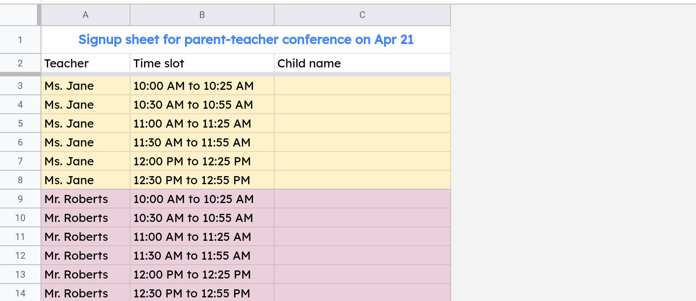
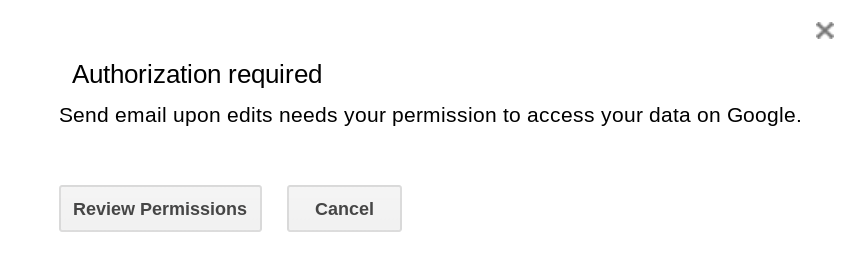
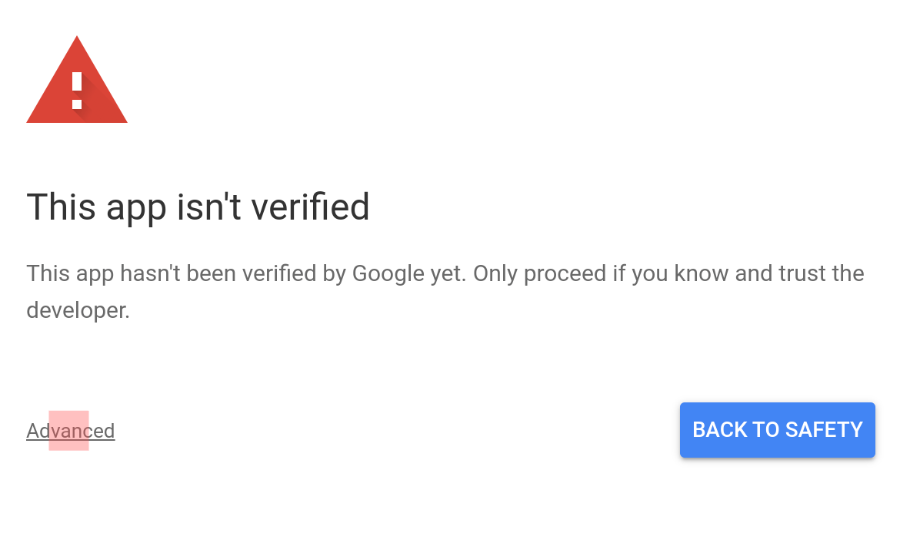

## Send email when google sheet is edited

Suppose you're a school teacher and you're planning an upcoming Parent-Teacher conference. Instead of using a printed sign up sheet, you decide to use a Google Sheets spreadsheet where parents can sign up for a meeting slot.
## What you will build in this tutorial
First, you will create a spreadsheet where parents can sign up for a slot.

Next, you will create a HTML email template and write some Apps Script code to send out emails.

Finally, you will automate sending this email notification whenever your spreadsheet is edited by a parent.

Below is a screenshot of the email you'll receive whenever a parent signs up for a slot. The email includes all of the information in the spreadsheet and it highlights the row that was edited

##Prerequisites
This tutorial assumes that you are reasonably familiar with Google Sheets and Google Apps Script. In particular, it assumes that you know:

Basic coding concepts and ideally some familiarity with JavaScript.

How to create a Google Apps Script?

How to send email from Google Sheets?

How to send HTML email from Google Sheets?

What are Triggers and when to use them?
##Five steps to begin sending an email notification whenever your Google Sheets spreadsheet is edited.

Step 1: Create your spreadsheet.

Step 2: Create a script that will send out the email notification.

Step 3: Set up a trigger to run your script whenever your spreadsheet is edited.

Step 4: Confirm that emails are sent whenever your spreadsheet is edited.

Step 5: Create an HTML email to make the notification more useful
##Step 1 — Create a Google Sheets spreadsheet where parents can sign up for a meeting slot.
Create a sheet containing three columns: Teacher, Time slot and Child name. Since the class has two teachers and twelve kids, you decide to create six 25-minute long slots between 10:00 AM and 1:00 PM with 5-minute breaks in-between slots. Delete all the rows and columns in the spreadsheet that you will not be using.

Parents can sign up for a slot by entering their child's name in the third column (Column C).

## Step 2 — Create an Apps Script function that will send out email notifications
Step 2.1 — Create the script
Open the Script editor by selecting Tools —> Script editor and replace the code in the editor with the code below.
⚠ Please replace the email address in the code snippet below with your email address.
//@OnlyCurrentDoc
function processEdit(e) {  
  MailApp.sendEmail({
    to: "youremail@example.com",
    subject: "New sign up -- parent teachers conference",
    body: "The Parent-Teacher conference sign up sheet was edited."
  });
}

How does the above code work?
The processEdit() function will be run (by the trigger that you'll be setting up shortly) whenever your spreadsheet is edited.

The argument e is an object containing information about the edits that were made. For example, its range property will tell you the cell (or the range) that was edited.

The function body uses the MailApp object to send an email.

The //@OnlyCurrentDoc annotation tells Apps Script that you only want your script to get access to this spreadsheet and not your other files in Google Drive.
##Step 2.2 — Test your script by running it
Step 2.2.1 — Click the run button (play icon) to run the processEdit function.

## Step 2.2.2 — Authorize your script

Apps Script will ask you to authorize your script. Click Review Permissions to continue.

You might be asked to select a Google Account if you are signed into multiple accounts.

Google will warn you that your app isn't verified. Whenever you see this warning, you should only proceed if you trust the developer that created the script. In this case, you are the developer so it is fine to proceed. Click Advanced to continue.

