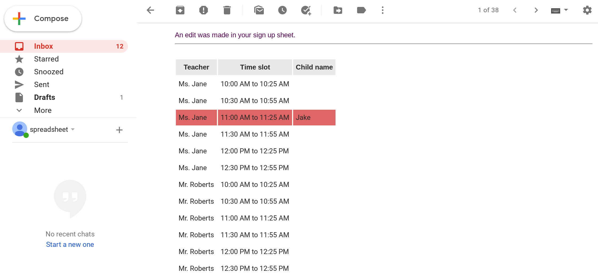

## Send email when google sheet is edited

Suppose you're a school teacher and you're planning an upcoming Parent-Teacher conference. Instead of using a printed sign up sheet, you decide to use a Google Sheets spreadsheet where parents can sign up for a meeting slot.
## What you will build in this tutorial
First, you will create a spreadsheet where parents can sign up for a slot.

Next, you will create a HTML email template and write some Apps Script code to send out emails.

Finally, you will automate sending this email notification whenever your spreadsheet is edited by a parent.

Below is a screenshot of the email you'll receive whenever a parent signs up for a slot. The email includes all of the information in the spreadsheet and it highlights the row that was edited
